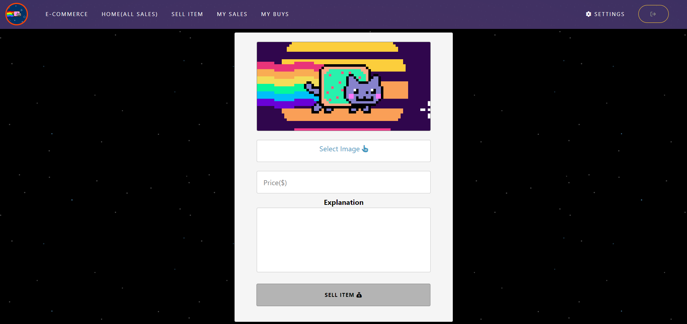

## Angular E-Commerce Application
This app is built with Node.js API.
FontAwesome and Bootstrap are used in the application.
When necessary, incoming data according to HTTP requests is used.
Below you can see the styles of the application and what the front of it looks like.

If the user enters the correct information in the login sections,
a token named "token" is kept in LocalStorage.
All transactions are carried out on this token.

Photo extensions of static photos that come with
GET requests are managed by the directive.
An interceptor is written for all requests. (For token)

Some ready-made templates are used.

## Login Page

## All Sales Page (When Empty)

## User Purchased Page (When Empty)

## User Sales Page

## User Sales Page (When Empty)

## Change Profile Photo

## Settings Page

## User Purchased Page

## Sell A Item!

Created At 3 December 2022.
